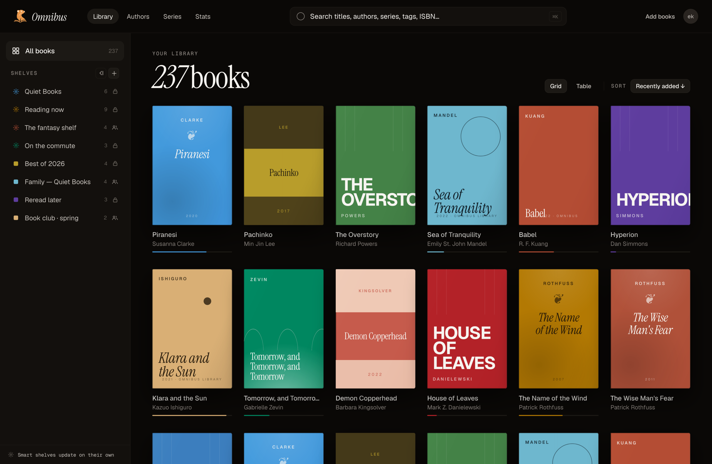
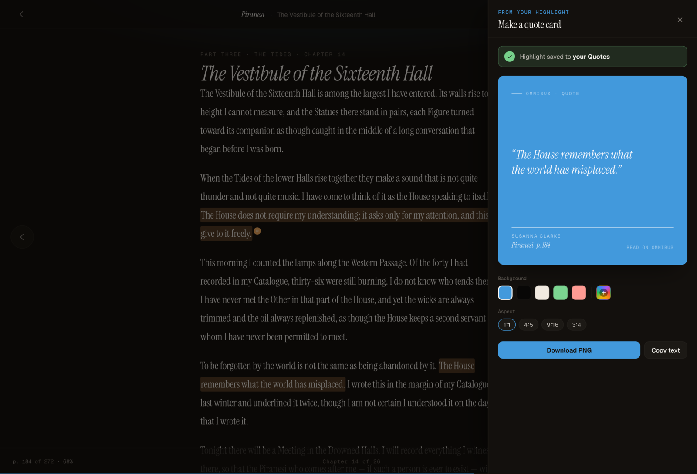
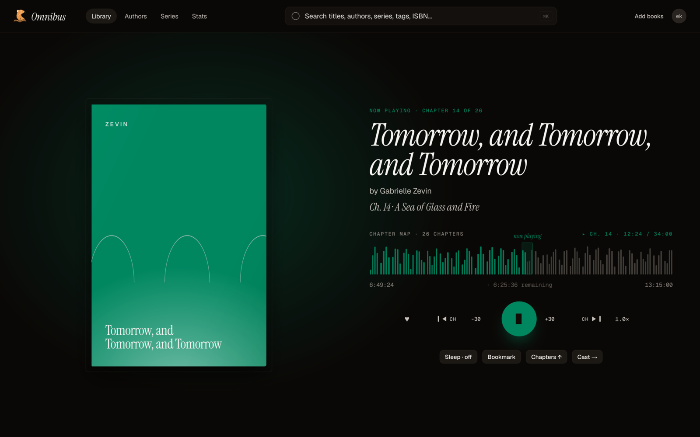
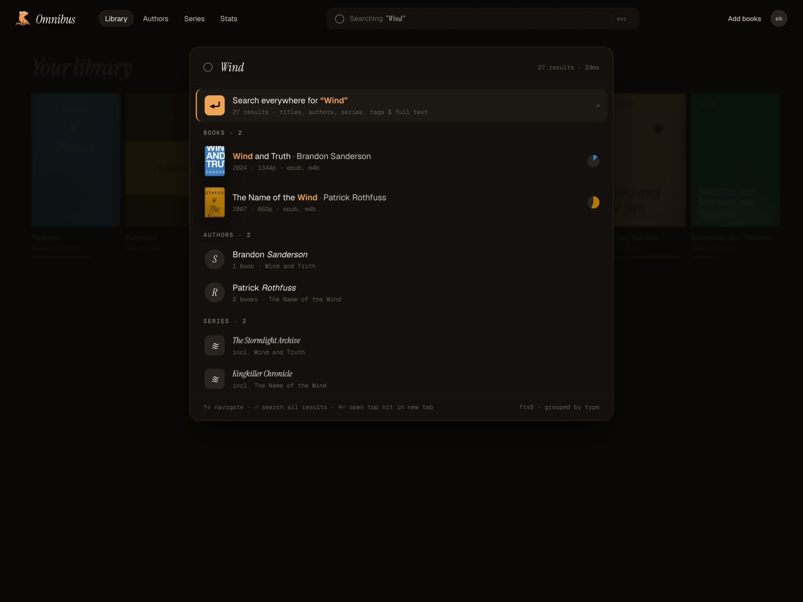
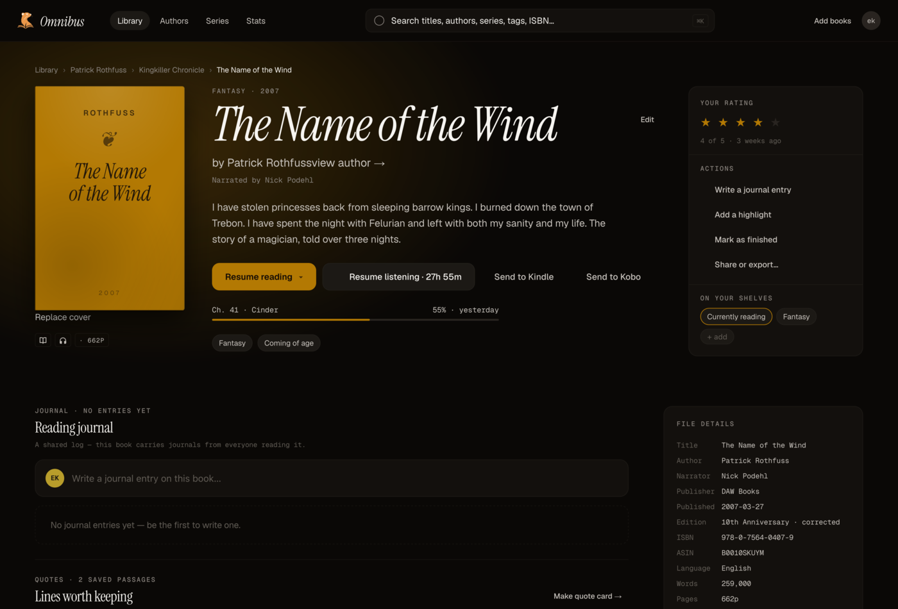

<div align="center">


# Omnibus

**The Plex / Jellyfin for your books.**
A self-hosted ebook & audiobook library — read in the browser, listen anywhere, and browse a collection that belongs entirely to you.

Built with Rust ([Axum](https://github.com/tokio-rs/axum) + [Dioxus](https://dioxuslabs.com/)), SQLite, and a native iOS / Android shell.

[](https://github.com/seamus-sloan/omnibus/actions/workflows/rust.yml)
[![Playwright](https://img.shields.io/github/actions/workflow/status/seamus-sloan/omnibus/e2e.yml?branch=main&label=Playwright&logo=data%3Aimage%2Fsvg%2Bxml%3Bbase64%2CPHN2ZyB4bWxucz0iaHR0cDovL3d3dy53My5vcmcvMjAwMC9zdmciIHZpZXdCb3g9IjAgMCA0MDAgNDAwIj4KPHBhdGggZmlsbD0iIzJFQUQzMyIgZD0iTTM0MS44IDEyOS4yYy0xMi40IDIuMi00Mi4zIDQuOS03OS4yLTUtMzYuOS05LjktNjEuNC0yNy4yLTcxLjEtMzUuMy0xMy44LTExLjUtMTkuOC0xOS41LTI1LjctNy40LTUuMyAxMC43LTEyIDI4LjEtMTguNSA1Mi40LTE0LjEgNTIuNy0yNC43IDE2My44IDYyLjYgMTg3LjIgODcuMiAyMy40IDEzMy43LTc4LjIgMTQ3LjgtMTMwLjkgNi41LTI0LjMgOS40LTQyLjcgMTAuMi01NC42LjktMTMuNC04LjQtOS41LTI2LjEtNi40eiIvPgo8cGF0aCBmaWxsPSIjMUQ4RDIyIiBkPSJNMjI1LjMgMjY5LjJjLTQxLTEyLTQ5LjItNDUuMi00OS4yLTQ1LjJsNTYuOCAxNS45IDMwLjEtMTE1LjZjLTM2LjktOS45LTYxLjctMjcuMy03MS40LTM1LjQtMTMuOC0xMS41LTE5LjgtMTkuNS0yNS43LTcuNC01LjMgMTAuNy0xMiAyOC4xLTE4LjUgNTIuNC0xNC4xIDUyLjctMjQuNyAxNjMuOCA2Mi42IDE4Ny4ybDEuOC40eiIvPgo8cGF0aCBmaWxsPSIjMkQ0NTUyIiBkPSJNMTkzLjkgMTY3LjZjMTEuOSAzLjQgMTguMiAxMS43IDIxLjUgMTkuMWwxMy4yIDMuOHMtMS44LTI1LjgtMjUuMS0zMi40Yy0yMS44LTYuMi0zNS4zIDEyLjEtMzYuOSAxNC41IDYuNC00LjUgMTUuNy04LjIgMjcuMy01ek0yOTkuNCAxODYuOGMtMjEuOS02LjItMzUuMyAxMi4xLTM2LjkgMTQuNSA2LjQtNC41IDE1LjctOC4yIDI3LjMtNSAxMS45IDMuNCAxOC4yIDExLjcgMjEuNSAxOS4xbDEzLjMgMy44cy0xLjktMjUuOC0yNS4yLTMyLjR6Ii8%2BCjxwYXRoIGZpbGw9IiNFMjU3NEMiIGQ9Ik0xNjEuNyAyMjAuMXYtOTJoMzEuMmMtMy40LTEwLjUtNi43LTE4LjYtOS41LTI0LjItNC42LTkuMy05LjMtMy4xLTE5LjkgNS44LTcuNSA2LjMtMjYuNCAxOS42LTU0LjkgMjcuMy0yOC41IDcuNy01MS41IDUuNi02MS4xIDMuOS0xMy42LTIuNC0yMC44LTUuNC0yMCA1IC42IDkuMSAyLjggMjMuMyA3LjcgNDIuMSAxMC44IDQwLjUgNDYuNCAxMTguNiAxMTMuOCAxMDAuNSAxNy42LTQuNyAzMC0xNC4xIDM4LjYtMjYuMWgtMjUuOXYtMjIuNWwtNjIuNCAxNy43czQuNi0yNi44IDM3LjEtMzZjOS45LTIuOCAxOC40LTIuOCAyNS4zLTEuNXoiLz4KPHBhdGggZmlsbD0iI0Q2NTM0OCIgZD0iTTEzOS45IDI0NmwtNDAuNiAxMS41czQuNC0yNS4xIDM0LjMtMzVsLTIyLjktODYuMi0yIC42Yy0yOC41IDcuNy01MS41IDUuNi02MS4xIDMuOS0xMy42LTIuNC0yMC44LTUuNC0yMCA1IC42IDkuMSAyLjggMjMuMyA3LjcgNDIuMSAxMC44IDQwLjUgNDYuNCAxMTguNiAxMTMuOCAxMDAuNWwyLS42eiIvPgo8cGF0aCBmaWxsPSIjMkQ0NTUyIiBkPSJNMTM2LjQgMjIxLjZjLTEyLjkgMy43LTIxLjMgMTAuMS0yNi45IDE2LjUgNS4zLTQuNyAxMi41LTkgMjIuMS0xMS43IDkuOS0yLjggMTguMy0yLjggMjUuMi0xLjR2LTUuNGMtNS45LS41LTEyLjctLjItMjAuNCAyek0xMDguOSAxNzUuOWwtNDcuOCAxMi42czEwLjYgMTUuMyAyOC41IDEwLjVjMTcuOS00LjcgMTkuMy0yMy4xIDE5LjMtMjMuMXoiLz4KPC9zdmc%2B&logoColor=white)](https://seamus-sloan.github.io/omnibus/)
[](https://github.com/seamus-sloan/omnibus/actions/workflows/css-lint.yml)
[](https://hub.docker.com/r/sesloan/omnibus/tags)
[](https://hub.docker.com/r/sesloan/omnibus/tags)
[](https://hub.docker.com/r/sesloan/omnibus)

</div>

<div align="center">

</div>

> [!NOTE]
> **This is in active development.** Foundations and browse/discovery have shipped;
> reading/listening is in progress. The landing grid/table, EPUB reader,
> audiobook player, command-palette search, auth, and author/series/tag
> discovery are live. See the [roadmap](https://github.com/users/seamus-sloan/projects/2/views/9) for what's next.

## Features

- 📚 **A real library, not a file list** — cover-art grid or dense metadata table, plus smart & shared shelves that update themselves.
- 📖 **In-browser EPUB reader** — pick up where you left off, progress synced server-side.
- 🖍️ **Highlights & quote cards** — save passages and export a shareable quote card in a tap.
- 📤 **Send to your device** — push any ebook straight to your Kobo or Kindle, no Calibre round-trip.
- 🎧 **Audiobook player** — HLS-transcoded streaming with a chapter map, resumable across devices.
- ⌘ **Command-palette search** — `⌘K` for full-text search across titles, authors, series, and tags.
- 🧭 **Rich book pages** — your own ratings, reading journals, series tracking, and reading insights on your own database.
- 🔗 **Discovery** — browse by author, series, and tag; "readers also enjoyed" suggestions via Hardcover.
- 📱 **Native mobile app** — an iOS / Android shell over the same backend.
- 🐳 **Self-hosted, Jellyfin-style** — bind-mount your library, one `docker compose up`.

## Screenshots

<div align="center">

| Read & highlight | Listen |
|:---:|:---:|
|  |  |
| **Search everything** | **Every book, in depth** |
|  |  |

</div>

## Deploy with Docker

The fastest way to run Omnibus. The image is published to
[Docker Hub as `sesloan/omnibus`](https://hub.docker.com/r/sesloan/omnibus/tags),
and the repo ships a Jellyfin-style [`docker-compose.yml`](docker-compose.yml):
bind-mount your ebook library read-write (in-UI uploads file into it; use `:ro`
if you never upload), durable state in `/config`, regenerable cache in `/cache`.

```bash
# 1. Point the library mounts at your books and set your access URL.
$EDITOR docker-compose.yml

# 2. Build the bundle and start it (first build compiles the workspace + WASM).
docker compose up -d --build

# 3. Open http://localhost:3000 and register — the first account is the admin.
```

Full deployment reference — volumes, env vars, reverse-proxy/TLS, PUID/PGID, and
admin recovery — is in [docs/docker.md](docs/docker.md).

## Develop

Development uses [Nix](https://wiki.nixos.org/wiki/NixOS_Wiki) to pin every
dependency (Rust toolchain, SQLite, Node, mobile SDKs). **Always work inside the
dev shell.**

```bash
nix develop                 # slim default shell (spawns bash)
nix develop --command zsh   # …keeping your shell
direnv allow                # or auto-load via direnv (once)
```

**The `just` recipes are the quickest way in.** They self-wrap in the right Nix
shell, so they run straight from the slim `default` shell:

```bash
just serve       # full stack in Zellij — server + web + mobile + Playwright panes
just serve-pc    # …the same stack via process-compose
just dev-up      # just the web server: port-walks, seeds the admin user
just dev-bounce  # cleanly restart a wedged dev server (e.g. after a migration)
```

`just serve` / `just serve-pc` multiplex every platform into one session using
the shared [`Justfile`](Justfile). Prefer to drive the pieces yourself?

```bash
dx serve --platform web -p omnibus   # fullstack SSR + WASM at http://localhost:8080
cargo run -p omnibus                 # server only (native backend) at http://0.0.0.0:3000
```

### Nix shells

The flake exposes purpose-built shells so daily cargo work doesn't pull in
Playwright + mobile + audit tooling. Opt into a heavier shell only when you need
it (the `just` recipes above pick the right one for you):

| Shell | When to use |
|---|---|
| `default` | Daily `cargo` / `clippy` / `test` / editor — what direnv auto-loads |
| `.#web` | `dx serve --platform web`, `just dev-up`, anything that bundles WASM |
| `.#e2e` | `npx playwright test` (the Chromium bundle lives here) |
| `.#mobile` | Android / iOS builds (Rust cross-targets + JDK + Android NDK detect) |
| `.#audit` | `cargo audit` / `cargo deny` |

| Variable | Default |
|---|---|
| `PORT` | `3000` |
| `DATABASE_URL` | `sqlite://omnibus.db?mode=rwc` |

Secret-bearing config lives in a gitignored `.env` — copy [`.env.example`](.env.example)
on first checkout. It's the canonical, annotated reference for every supported
variable.

## Mobile app

The mobile app is a Dioxus Native shell that connects to `http://127.0.0.1:3000`,
so **start the server first** (`just serve` handles this). The iOS and Android
panes inside `just serve` build and launch the app for you; the one-time platform
setup below still applies.

### iOS Simulator

Requires macOS with Xcode and at least one iOS Simulator installed (add one via
**Xcode → Window → Devices and Simulators**). The iOS pane then launches the
simulator and installs the app with no extra commands.

### Android Emulator

1. **Install Android Studio** — [developer.android.com/studio](https://developer.android.com/studio)
2. **Install the NDK** — **Tools → SDK Manager → SDK Tools → check "NDK (Side by side)" → Apply**
3. **Create an emulator** — **Tools → Device Manager → Create Virtual Device** (API 33+ recommended), then start it.
4. **Enter the mobile dev shell** — it auto-detects `ANDROID_HOME` / `ANDROID_NDK_HOME`:

   ```bash
   nix develop .#mobile --command zsh
   echo $ANDROID_HOME       # e.g. /Users/<you>/Library/Android/sdk
   echo $ANDROID_NDK_HOME   # e.g. …/sdk/ndk/28.x.x
   ```

   If they're empty, set them manually:

   ```bash
   export ANDROID_HOME=$HOME/Library/Android/sdk
   export ANDROID_NDK_HOME=$ANDROID_HOME/ndk/$(ls $ANDROID_HOME/ndk | tail -1)
   ```

5. If the app can't reach the server after boot, run `adb reverse tcp:3000 tcp:3000`.

## Tests

```bash
just test    # full matrix: db + server + frontend(--features server) + shared
just lint    # cargo fmt --check + clippy across the crate/feature matrix + stylelint
just check   # lint then test

# …or per-crate. Note: `cargo test --workspace` SKIPS the frontend rpc/page
# tests (they need --features server to compile the server-function bodies)
# and mobile (out of default-members, no tests), so run each crate explicitly:
cargo test -p omnibus                              # /api/* REST integration tests
cargo test -p omnibus-db                           # db + scanner + sync tests
cargo test -p omnibus-frontend --features server   # rpc + page tests (server feature required)
cargo test -p omnibus-shared                       # shared serde / ebook / progress tests

# Web E2E (Playwright — server must be running; Chromium comes from Nix)
cd ui_tests/playwright
npm install                 # first time only; do NOT run `npx playwright install`
npx playwright test
```

Mobile tests are using [Maestro](https://maestro.dev/) to allow for writing a test once
validating on both operating systems.

## Project layout

Five-crate Cargo workspace:

| Crate | Responsibility |
|---|---|
| `shared/` | serde types shared across crates |
| `db/` | data layer, indexer, migrations |
| `frontend/` | Dioxus UI + server functions |
| `server/` | fullstack binary + REST router |
| `mobile/` | thin native shell |

Deeper architecture — module maps, request-flow diagrams, mobile-auth — is in
[docs/architecture.md](docs/architecture.md). Contributor conventions live
under [.claude/](.claude/) (dev environment, error handling, testing, migrations,
style).

